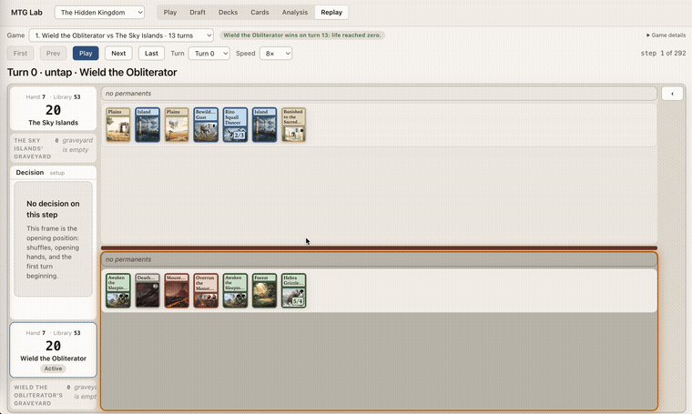
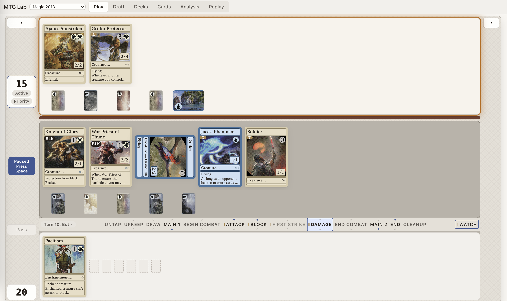
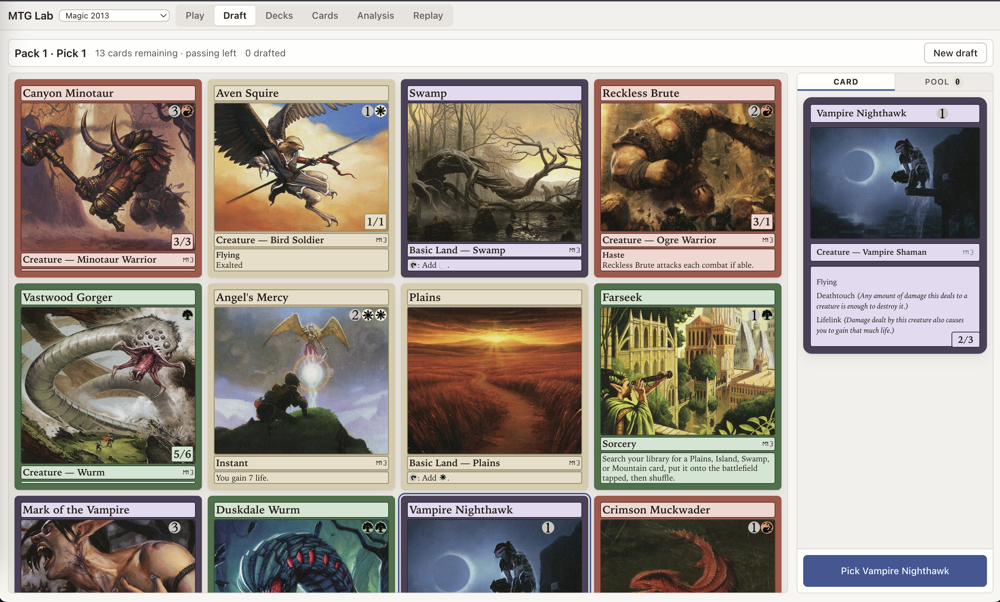
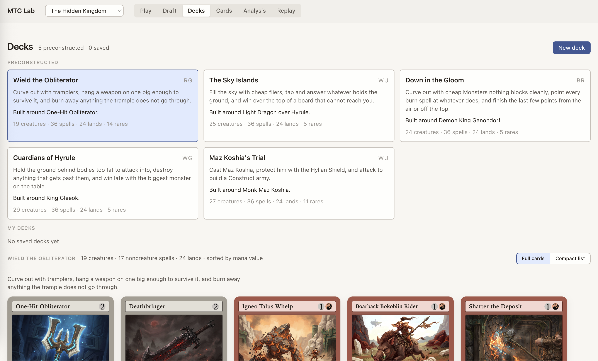
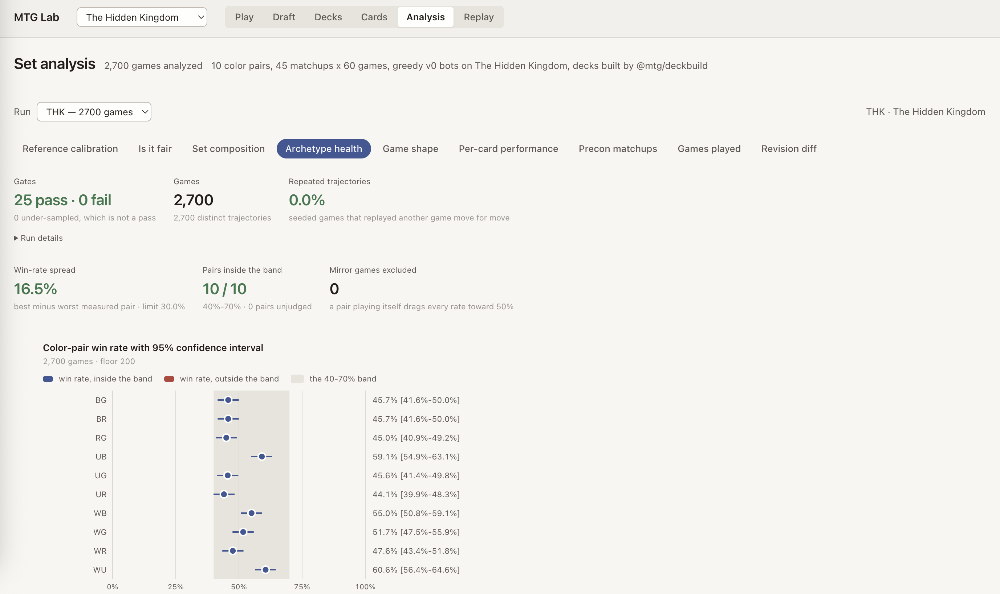

# Magic: The Gathering Set Generation and Playing Lab

A Magic: The Gathering **set generator** and **playing lab**, in strict TypeScript.

A model designs cards; a typed mechanics DSL is the only thing it is allowed to
emit; an event-sourced rules kernel runs them; a bot plays tens of thousands of
seeded games; a metrics gate decides whether the format is healthy; and a
browser lab lets a person play the result. The load-bearing invariant is that
the generator's output space stays **inside** the engine's enforceable space:
cards are emitted in the DSL, never free text the engine cannot run.

## Play in the browser

The browser UI ships in `packages/ui`. It supports sealed-deck play,
drafting, bot games, replay inspection, card rendering and format analysis. The
committed Tideglass Reach set works immediately without an API key or network
connection:

```bash
npm ci
npm run play
```

To run the generation and balance pipeline:

```bash
npm run slice         # the whole loop: set-gen, deck build, mass sim, metrics verdict
npm run test:balance  # the seeded 10,035-game format-health gate
```



_A real sealed game of The Hidden Kingdom, the generated flagship set, running
end to end through the browser lab._



_Mid-combat: the stack, the phase bar and both players' boards in one view._



_Pack, selected-card rail and pick action, all reading from the same
executable generated set._



_The full card gallery, filterable by color, type, rarity and mana value._



_Balance is a CI assertion, not a vibe: the same win-rate bands checked by
`npm run test:balance` are inspectable in the browser._

## What works today

### UI

- Six browser routes ship now: Play, Draft, Deck, Analysis, Replay and Cards.
- Play deals a sealed pool or opens committed preconstructed decks, then runs a
  two-player game against a bot through the same kernel used by simulation.
- The gameplay surface has dedicated portrait and landscape phone layouts,
  coarse-pointer controls, touch-safe card inspection and a full-screen
  landscape table. Desktop and tablet layouts use the same components.
- Draft supports collated packs and bot seats. Deck renders generated pools and
  real-card builds. Replay steps through recorded kernel decisions. Analysis
  reads simulation and calibration artifacts rather than recomputing them in
  the browser.
- Missing data is explicit. An unstaged replay, an invalid deck and a card with
  no art are different visible states, never blank screens.

### Mechanics and rules engine

- The strict DSL and event-sourced two-player kernel cover zones, mana and
  casting, priority and the stack, targeting, combat, tokens, counters,
  attachments and Equipment, continuous effects, replacement effects, and
  static, triggered, activated and loyalty abilities.
- Implemented keyword behavior includes flying, vigilance, haste, trample,
  deathtouch, lifelink, menace, reach, first strike, double strike, defender,
  landwalk, hexproof, indestructible, protection and exalted.
- The executable effect vocabulary includes damage, destruction, temporary power/toughness
  changes, card draw, life gain, counterspells, tokens, tapping, bounce,
  milling, counters, exile, scry and graveyard return.
- This is deliberately not all of Magic. A real printing is executable only
  when it has an exact DSL representation that the kernel reaches. Unsupported
  cards are refused instead of approximated, and the generator is narrower
  than the hand-authorable engine vocabulary.
- M11 and M13 are the primary reference sets for measuring that exact subset;
  additional core sets and expansions are retained as secondary or stress
  references.

## What is planned

### UI

- Land the navigation and responsive-panel work shown above, including the
  five-destination mobile bar, compact Draft pack and contextual card rail.
- Finish real-device mobile review across Deck, Analysis, Replay and Cards.
  Gameplay has the deepest phone-specific coverage today.
- Broaden human draft and deckbuilding journeys, connect Replay to Analysis as
  a per-game drill-down, and make multi-seat play a first-class surface.
- Keep desktop and phone screenshots reproducible from accessible-name browser
  journeys so the README always depicts the code that ships.

### Mechanics and rules engine

- Expand the exact executable slice of M11 and M13 card by card, using each
  refusal as a named missing capability rather than adding a permissive text
  interpreter.
- Extend targeting, zone changes, continuous layers and replacement ordering
  for the complex cards that remain outside the DSL.
- Widen generation only after the corresponding schema, kernel behavior,
  simulator policy and regression scenario all exist.
- Continue Forge subprocess parity checks while keeping GPL code outside this
  repository.

## Real card data and images

The public repository includes the complete on-demand path used by the Deck
view:

1. `@mtg/data` streams Scryfall bulk metadata into a gitignored local SQLite
   store with a descriptive user agent, rate limiting and resumable checkpoints.
2. `@mtg/decklab` chooses a printing and carries its Scryfall `art_crop` URL,
   artist and set code in the deck artifact.
3. `@mtg/image-cache` fetches each URL once into a gitignored cache.
4. `npm run lab` stages only the illustrations that deck uses onto the UI's
   origin, preserving visible artist and set credit. It never mirrors the image
   corpus.

Scryfall supplies the card metadata and image delivery service; it does not own
or license the underlying Magic artwork. Wizards of the Coast owns the cards
and artwork. Their use here is governed by the Fan Content terms below, and the
project remains free and unofficial.

## Fan Content

Portions of the materials used are property of Wizards of the Coast. ©Wizards of the Coast LLC.

This lab is unofficial Fan Content permitted under the Fan Content Policy. Not approved/endorsed by Wizards.

The code is MIT (see `LICENSE`, which is explicit about what it does and does
not cover). Attribution for card data, vocabulary data, human play data and the
engines this project references is in `NOTICE`; npm dependencies are in
`THIRD-PARTY-NOTICES.md`.

## The shape of it

| Layer       | Packages                                 | What it is                                                                           |
| ----------- | ---------------------------------------- | ------------------------------------------------------------------------------------ |
| Language    | `dsl`                                    | the typed mechanics DSL; card, ability and effect schemas, oracle-text rendering     |
| Engine      | `kernel`                                 | event-sourced rules kernel: layers, replacement effects, the stack, combat           |
| Play        | `deckbuild`, `sim`, `metrics`            | deck construction, a scoring bot, seeded mass simulation, format-health gates        |
| Generation  | `llm`, `design-data`, `setgen`           | the provider seam, the color pie and set skeleton, and the generator that fills them |
| Real cards  | `data`, `decklab`, `cube`, `image-cache` | the Scryfall/MTGJSON ingest and everything built on a real card pool                 |
| Export      | `forge-export`, `draft-export`           | Forge card scripts as a conformance oracle; Draftmancer custom-set files             |
| Surface     | `ui`, `card-render`                      | the browser lab and the printed 63 x 88 mm SVG face                                  |
| Composition | `slice`, `referee`                       | the one-command loop, and the schema-constrained ruling seam                         |

Every package resolves from source. There is no build step in development:
`tsconfig.json` maps `@mtg/*` straight at `packages/*/src/index.ts`, and the
vitest config repeats the alias so a test always runs this checkout's sources.

## The example set

`tideglass-reach` is the committed example: 90 original cards, generated by the
pipeline in this repository from the brief at
`packages/setgen/briefs/tideglass-reach.json`, replayed deterministically from
recorded model responses under `packages/setgen/fixtures/llm/`. It needs no API
key to reproduce:

```bash
npx tsx packages/setgen/src/cli.ts \
  --brief packages/setgen/briefs/tideglass-reach.json --out out/set
```

It is also the balance gate's declared subject, measured at 10,035 seeded games
with an empty waiver list.

## Gates

```bash
npm run typecheck     # tsc --noEmit, strict, noUncheckedIndexedAccess + exactOptionalPropertyTypes
npm test              # vitest, unit + balance projects
npm run lint          # eslint packages --max-warnings=0
npm run format        # prettier --check
```

Balance is a continuous-integration assertion rather than a vibe: seeded sims,
win-rate bands and a no-dominant-strategy guard, all as tests, with every
known-red gate waived one at a time against the number measured when it was
waived.

## Conventions

`AGENTS.md` holds the binding ones: workspace layout, the `package.json`
template, code style, the LLM-provider rules, third-party engine licensing, the
destructive-command rule, and two web-UI constraints that fail silently rather
than loudly. Read it before writing code.
